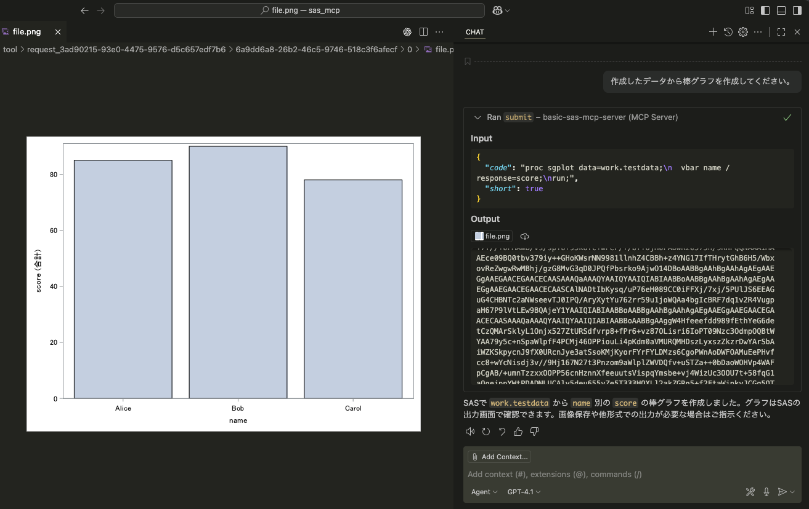

# Basic SAS　MCP　Server
saspyをベースとしたMCPサーバーです。  
saspyによりメタデータの取得やコードの実行等を行います。  

SASによるMCPクライアント・ホスト等のプログラムは[こちら](https://github.com/k-nkmt/sas_ai_utilities)

セッション管理により、前のツールによる処理に続いて操作が可能です。  
また、出力について長さや形式などを調整し、画像の出力にも対応します。

以下の機能を設定しています。  
__tool__　 
- submit — SAS コードを実行して結果を返す
- restart — SAS セッションを再起動
- assigned_librefs — 割り当てられたライブラリ参照の一覧を返す
- list_tables — 指定ライブラリ内のテーブル一覧を返す
- columnInfo_t — 指定テーブルのカラム情報を返す（ツール）
- head — 指定テーブルの先頭行を返す
- print — 指定テーブルの全レコードを表示（ラベル付き）

__resource__
- cat — ファイルの内容を返す
- columnInfo_r — 指定テーブルのカラム情報を返す

通信形式は個人レベルなら使いやすいstdioとしていますが、必要があれば適宜変更してください。  
toolやresourceでは基本的にはsaspyの関数やメソッド、引数も同じ名前を使用しているので、必要があればsaspyの仕様も参照してください。

## 実行環境

- pythonとパッケージ・プロジェクト管理にuvを使用します。  
  https://docs.astral.sh/uv/ や各種資料を参考にuvをインストールしておいてください。  
- saspyの設定が必要になります。  
  https://sassoftware.github.io/saspy/configuration.html.  
  ホームディレクトリに共通のsascfg_personal.pyを準備しておく等の対応を行なってください。  

## 利用の手順
1. プログラムのダウンロード
gitからクローン、またはzipでダウンロードしてください。
2. 依存関係のインストール
`uv　sync`　で依存関係をインストールしてください。
3. MCPサーバーの設定
VSCodeの場合、ワークスペース用の設定ファイル(.vscode/mcp.json)を開き、`"--directory",`　の次の行をこのフォルダのパスに変更すると、このワークスペースでは有効になります。
詳細やその他のアプリケーション・サービスについては、それらの仕様を確認してください。

4. 必要に応じてtoolの追加などカスタムしてください。
また環境変数に`SAS_AUTOEXEC`,　`SAS_CFGNAME`を指定すると、saspyのセッションの引数として、使用される設定や起動時に自動で実行されるコードを指定できます。

## 注意
特にsubmitの機能は、生成されたコードがそのまま実行されることになります。   　
データやファイルの削除等、任意の操作ができてしまうので、利用を推奨はしません。  
実行する場合にはどのようなコードが実行されるのか、よく確認して許可するようにしてください。  
また確実に決まった動作をさせるためにも、一部パラメータのみを渡すような形でtoolやresourceを作成して利用することをおすすめします。  

## ライセンス
いわゆる[フェアソース](https://fair.io/about/)と呼ばれるFSL-1.1-MITとしています。  
2027/10 以降にはMITライセンスとなりますが、それまでの商用利用は制限されます。  
個人利用や非営利の教育・研究には自由に利用できますが、営利目的の利用は試用や評価を除き不可となります。    
個人開発の継続のため、制限へのご理解・ご協力をお願いします。  
期間内での営利目的の利用や、利用可能な範囲かわからない場合などはお問い合わせください。

---
An MCP server based on saspy.  
Uses saspy to get metadata and run SAS code.

MCP client/host programs in SAS are [here](https://github.com/k-nkmt/sas_ai_utilities).

Session management lets you continue operations across tools.  
Output length and format are optimized by truncating long results and formatting tables for readability; image output (e.g., PNG format) is supported for visualizations and plots.

Features:  
__tool__
- submit — Run SAS code and return results
- restart — Restart SAS session
- assigned_librefs — List assigned library refs
- list_tables — List tables in a library
- columnInfo_t — Column info for a table (tool)
- head — Return top rows of a table
- print — Print all records (with labels)

__resource__
- cat — Return file contents
- columnInfo_r — Column info for a table

Transport uses stdio by default (simple for personal use).  
Tool/resource names mostly match saspy functions/args. See saspy docs as needed.

## Environment
- Python with uv for package/project management: https://docs.astral.sh/uv/
- saspy configuration is required: https://sassoftware.github.io/saspy/configuration.html  
  Prepare a shared sascfg_personal.py in your home directory, etc.

## How to use
1. Download  
   Clone the repo or download as zip.
2. Install dependencies  
   Run: uv sync
3. Configure MCP server  
    If using VSCode, open the workspace configuration file (.vscode/mcp.json) and change the path after `"--directory",` to this folder. This will activate the configuration for the workspace.  
    For details or other applications/services, refer to their respective documentation. 
4. Customize as needed  
    Add new tools or modify existing ones as required.  
    You can also set the environment variables `SAS_AUTOEXEC` and `SAS_CFGNAME` to specify configuration and auto-execution code for the saspy session.

## Notes
The submit tool executes generated code as-is.  
It can perform any operation (e.g., delete files/data). Use with caution.  
Review code before allowing execution.  
For safer, deterministic behavior, create tools/resources that accept only specific parameters.

## License
Licensed under FSL-1.1-MIT (Fair Source).  
Becomes MIT after 2027/10; commercial use is restricted until then.  
Personal and non-profit education/research use is free. Commercial use (beyond trial/evaluation) is not allowed during the period.  
Contact us for commercial use within the period or if unsure about permitted usage.